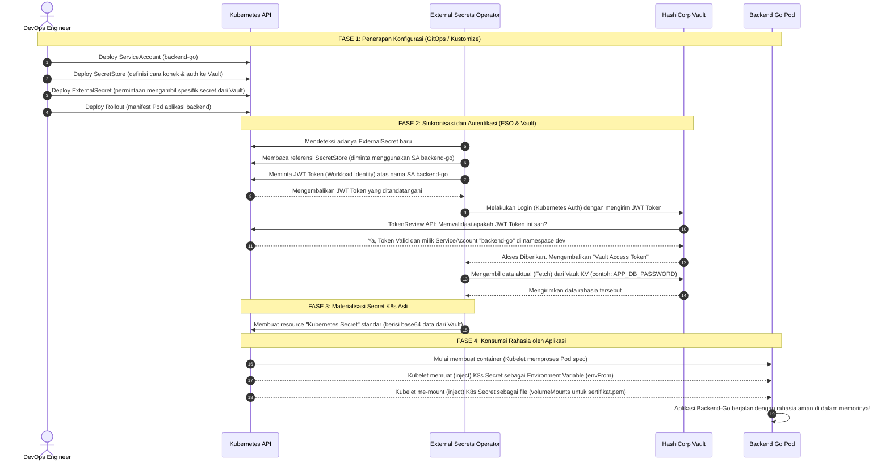

# Sequence Diagram: Vault & External Secrets

Diagram *Sequence* berikut menggambarkan **urutan kronologis** dari awal penerapan konfigurasi (deploy) hingga bagaimana Pod aplikasi akhirnya mendapatkan rahasia tersebut.

### Penjelasan Urutan Kejadian:

1. **Fase 1 (Langkah 1-4)**: Semua manifest di-*deploy* ke klaster. Kunci utamanya adalah kita membuat `ServiceAccount`, `SecretStore`, dan `ExternalSecret`. Manifest aplikasi (Rollout) mengarahkan Pod-nya agar me-load variabel menggunakan nama K8s Secret (meskipun wujud secret-nya belum ada di klaster).
2. **Fase 2 (Langkah 5-12)**: Inilah otak pergerakannya. `External Secrets Operator` akan bertindak sebagai agen/kurir yang secara otomatis bekerja. 
   - Supaya agen ini bisa membuktikan identitasnya ke Vault, ia meminta **token K8s JWT** dari ServiceAccount `backend-go` dan memberikannya ke Vault. 
   - Vault tidak langsung percaya, ia memvalidasi lagi token tersebut ke K8s API (TokenReview). 
   - Setelah yakin token itu asli, Vault mengizinkan ESO untuk membaca nilai rahasia (contoh: *Database Password*).
3. **Fase 3 (Langkah 13)**: ESO mengambil semua rahasia yang ia dapatkan dari Vault tadi, kemudian menuliskannya ke dalam wujud **Kubernetes Secret biasa** (berbentuk base64).
4. **Fase 4 (Langkah 14-17)**: Saat Kubelet menyalakan Pod `backend-go`, Pod tersebut akan otomatis memuat (load) Kubernetes Secret (hasil karya ESO di langkah 13) ke dalam Environment Variable (`envFrom`) atau menyimpannya sebagai file (`volumeMounts`).

Dengan cara ini, pengembang (Anda) hanya menaruh rahasia di dalam Vault. Di dalam Kubernetes tidak ada file `.yaml` yang menyimpan teks asli password Anda. Semuanya ditarik secara dinamis pada saat *runtime*.
